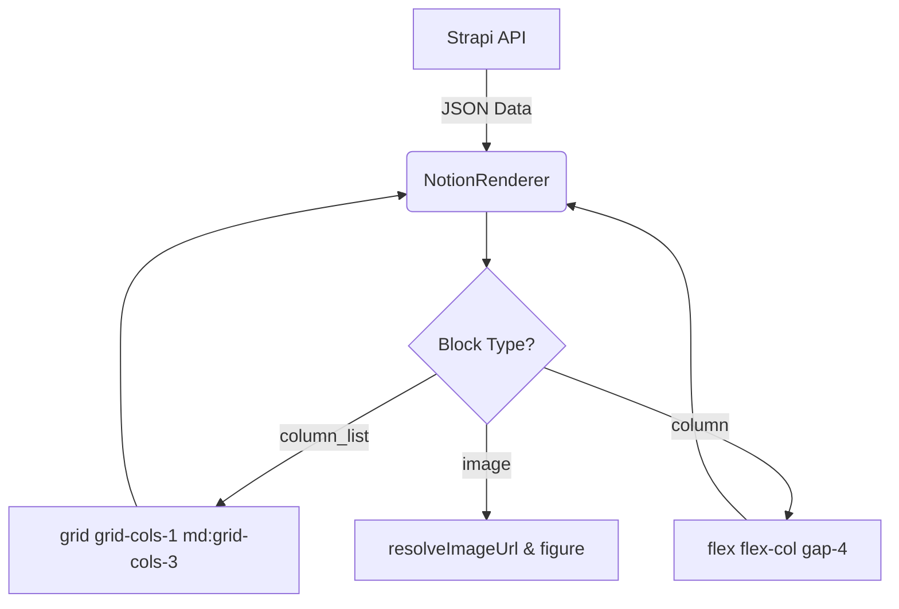

# Notion 3열 컬럼 및 이미지 렌더링 개선 계획 (NotionGlaze)

이 계획은 Notion의 3열 구조(`column_list`)를 유지하면서 Strapi로 업로드된 이미지 URL을 정확하게 매칭하고, Astro 프론트엔드에서 이를 그리드 레이아웃으로 완벽하게 재현하는 것을 목표로 합니다.

## 1. 분석 결과

현재 `NotionRenderer.astro`는 이미 `column_list`와 `column`을 처리하는 로직을 가지고 있으나, 다음과 같은 개선이 필요합니다:
- **n8n:** 기존의 `flatten` 로직이 구조를 파괴하여 3열 정보를 상실했을 가능성이 큼. 재귀적으로 URL만 바꾸는 방식으로 회귀 필요.
- **Astro:** 현재 `flex-col md:flex-row` 방식도 나쁘지 않으나, 정확한 3열 고정을 위해 `grid` 시스템 도입 검토 및 이미지 URL 추출 로직의 안정성 강화.

---

## 2. 세부 구현 계획

### 1단계: n8n "Final Prep" 노드 (데이터 전처리)
데이터 구조(Depth)를 건드리지 않고, `allBlocks` 내부를 재귀적으로 탐색하며 `image` 블록의 URL만 Strapi 주소로 치환합니다.

```javascript
// 핵심 로직: 구조 보존형 재귀 업데이트
function updateBlockContent(blocks) {
    for (let block of blocks) {
        if (block.type === 'image') {
            const update = updates.find(u => u.blockId === block.id);
            if (update && update.newUrl) {
                block.image.type = 'file';
                block.image.file = { url: update.newUrl };
                if (block.image.external) delete block.image.external;
            }
        }
        // 자식 노드가 있으면 깊이와 상관없이 파고듦
        if (block.children && block.children.length > 0) {
            updateBlockContent(block.children);
        }
    }
}
```

### 2단계: Astro `NotionRenderer.astro` 개선
이미 구현된 `column_list` 로직을 사용자 제안에 따라 `grid` 방식으로 최적화하고, `resolveImageUrl`의 범용성을 유지합니다.



#### 주요 변경 예정 사항 (Astro):
- `column_list`: `flex` 대신 `grid grid-cols-1 md:grid-cols-3` 적용 (균등한 3열 보장)
- `image`: `src` 속성에 `resolveImageUrl(imgValue)`를 사용하여 Strapi 도메인 보정 로직 활용

---

## 3. 할 일 목록 (TODO)

- [ ] **n8n 노드 수정:** "Final Prep" 노드의 자바스크립트 코드를 재귀 방식으로 교체
- [ ] **Astro 컴포넌트 수정:** [`src/components/Glaze/NotionRenderer.astro`](/workspace/NotionGlaze-ILOURA/src/components/Glaze/NotionRenderer.astro)의 `column_list` 렌더링 부분을 `grid` 클래스로 변경
- [ ] **검증:** Notion에서 3열 이미지를 구성한 후, Strapi를 거쳐 Astro에서 정상적으로 3단 배치가 되는지 확인

---

이 계획에 대해 어떻게 생각하시나요? 승인해 주시면 바로 `code` 모드로 전환하여 작업을 시작하겠습니다.
