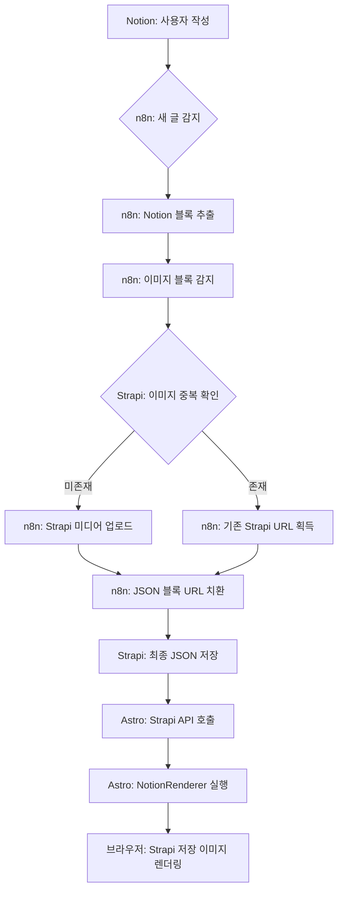

# Strapi 이미지 활용 프로세스 개선 계획안

본 계획안은 Notion에서 제공하는 임시 이미지 URL(만료 문제)을 배제하고, Strapi에 영구 저장된 이미지를 Astro 프론트엔드에서 안정적으로 렌더링하기 위한 개선 전략을 담고 있습니다.

## 1. 현재 구조 분석 및 문제점

*   **n8n:** Notion 블록을 가져와서 이미지 블록의 URL을 Strapi에 업로드하고, 블록 JSON 내의 URL을 Strapi URL로 치환하려 시도 중입니다.
*   **Strapi:** `Content` 필드(JSON 타입)에 Notion 블록 구조를 그대로 저장하고 있습니다.
*   **Astro:** `NotionRenderer.astro`에서 블록 데이터를 순회하며 이미지를 렌더링합니다.
*   **문제점:**
    1.  n8n에서 치환 로직이 완벽하지 않을 경우 여전히 `s3.us-west-2.amazonaws.com` 등 Notion 원본 URL이 남을 수 있습니다.
    2.  프론트엔드에서 Strapi 업로드 경로(`/uploads/...`) 처리가 일관되지 않을 수 있습니다.

## 2. 개선된 로직 계획

### A. n8n 워크플로우 강화
*   **이미지 중복 체크 고도화:** `alternativeText`에 Notion 블록 ID를 저장하여, 동일 블록에 대한 중복 업로드를 방지합니다.
*   **치환 로직 보장:** `Final Prep` 노드에서 모든 `image` 타입 블록의 `file.url` 또는 `external.url`이 반드시 Strapi 도메인(`https://strapi.iloura.co.kr`)을 포함하도록 강제합니다.
*   **실패 대응:** Strapi 업로드에 실패한 이미지는 프론트엔드에서 엑박(Broken Image)이 뜨는 것을 방지하기 위해 플레이스홀더 URL로 대체하거나 해당 블록을 제외합니다.

### B. Strapi 데이터 구조 최적화
*   이미지 블록 내에 `strapiId` 또는 `strapiUrl`과 같은 커스텀 필드를 추가하여 원본 Notion URL과 명확히 분리하여 저장하는 방안을 고려합니다. (단, 현재 JSON 구조를 유지한다면 `file.url`을 Strapi 전체 경로로 업데이트하는 것이 가장 깔끔합니다.)

### C. Astro 프론트엔드 (NotionRenderer) 개선
*   `resolveImageUrl` 함수의 로직을 단순화하고 우선순위를 정립합니다.
*   **우선순위:**
    1.  Strapi 내부 경로(`/uploads/`) 체크 -> Full URL로 변환
    2.  `strapi.iloura.co.kr` 도메인 포함 여부 체크
    3.  Notion 원본 URL(S3) 발견 시 로그 출력 및 기본 이미지로 대체 (선택 사항)

## 3. 시스템 아키텍처 다이어그램

## 4. 향후 실행 단계 (Todo)

1.  **n8n 워크플로우 수정:** `Map Updates` 및 `Final Prep` 노드에서 URL 치환 로직을 더 견고하게 수정.
2.  **Astro 유틸리티 수정:** [`src/components/Glaze/NotionRenderer.astro`](src/components/Glaze/NotionRenderer.astro)의 `resolveImageUrl` 함수가 Strapi 저장 이미지를 최우선으로 처리하도록 수정.
3.  **검증:** Notion에서 새 글을 작성하고, Strapi DB에 저장된 JSON을 확인한 뒤, Astro에서 이미지가 정상적으로(Strapi 경로로) 로드되는지 확인.

---
**이 계획안에 대해 승인해 주시면, Code 모드로 전환하여 구체적인 코드 수정을 진행하겠습니다.**
